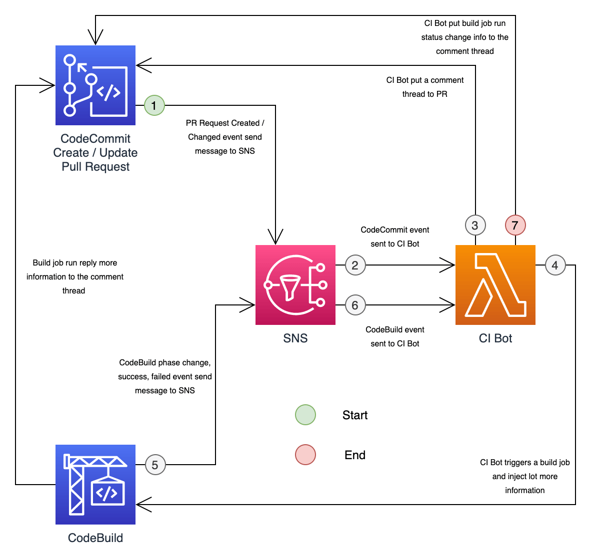

.. image:: https://readthedocs.org/projects/aws_ci_bot/badge/?version=latest
    :target: https://aws_ci_bot.readthedocs.io/index.html
    :alt: Documentation Status

.. image:: https://github.com/MacHu-GWU/aws_ci_bot-project/workflows/CI/badge.svg
    :target: https://github.com/MacHu-GWU/aws_ci_bot-project/actions?query=workflow:CI

.. image:: https://codecov.io/gh/MacHu-GWU/aws_ci_bot-project/branch/main/graph/badge.svg
    :target: https://codecov.io/gh/MacHu-GWU/aws_ci_bot-project

.. image:: https://img.shields.io/pypi/v/aws_ci_bot.svg
    :target: https://pypi.python.org/pypi/aws_ci_bot

.. image:: https://img.shields.io/pypi/l/aws_ci_bot.svg
    :target: https://pypi.python.org/pypi/aws_ci_bot

.. image:: https://img.shields.io/pypi/pyversions/aws_ci_bot.svg
    :target: https://pypi.python.org/pypi/aws_ci_bot

.. image:: https://img.shields.io/badge/STAR_Me_on_GitHub!--None.svg?style=social
    :target: https://github.com/MacHu-GWU/aws_ci_bot-project

------

.. image:: https://img.shields.io/badge/Link-Document-blue.svg
    :target: https://aws_ci_bot.readthedocs.io/index.html

.. image:: https://img.shields.io/badge/Link-API-blue.svg
    :target: https://aws_ci_bot.readthedocs.io/py-modindex.html

.. image:: https://img.shields.io/badge/Link-Source_Code-blue.svg
    :target: https://aws_ci_bot.readthedocs.io/py-modindex.html

.. image:: https://img.shields.io/badge/Link-Install-blue.svg
    :target: `install`_

.. image:: https://img.shields.io/badge/Link-GitHub-blue.svg
    :target: https://github.com/MacHu-GWU/aws_ci_bot-project

.. image:: https://img.shields.io/badge/Link-Submit_Issue-blue.svg
    :target: https://github.com/MacHu-GWU/aws_ci_bot-project/issues

.. image:: https://img.shields.io/badge/Link-Request_Feature-blue.svg
    :target: https://github.com/MacHu-GWU/aws_ci_bot-project/issues

.. image:: https://img.shields.io/badge/Link-Download-blue.svg
    :target: https://pypi.org/pypi/aws_ci_bot#files

Welcome to ``aws_ci_bot`` Documentation
==============================================================================

.. contents::
    :class: this-will-duplicate-information-and-it-is-still-useful-here
    :depth: 1
    :local:

1. How it Work
------------------------------------------------------------------------------

2. How to Deploy
------------------------------------------------------------------------------
.. contents::
    :class: this-will-duplicate-information-and-it-is-still-useful-here
    :depth: 1
    :local:

2.1. Create SNS Topic
~~~~~~~~~~~~~~~~~~~~~~~~~~~~~~~~~~~~~~~~~~~~~~~~~~~~~~~~~~~~~~~~~~~~~~~~~~~~~~
1. Go to `AWS SNS Topic Console <https://console.aws.amazon.com/sns/v3/home?#/topics>`_, click "Create Topic".
2. Check the following configuration:
    - Type: Standard
    - Name: put your SNS topic name ``${sns_topic_name}``
    - Access Policy (choose advanced) and put the following Policy document, make sure you replaced the variable ``${aws_region}``, ``${aws_account_id}``, ``${sns_topic_name}`` with the right value. It has to allow CodeCommit and CodeBuild to publish notification event to the Topic.::

        {
            "Version": "2008-10-17",
            "Statement": [
                {
                    "Sid": "CodeNotification_publish",
                    "Effect": "Allow",
                    "Principal": {
                        "Service": "codestar-notifications.amazonaws.com"
                    },
                    "Action": "SNS:Publish",
                    "Resource": "arn:aws:sns:${aws_region}:${aws_account_id}:${sns_topic_name}"
                }
            ]
        }

 3. Click "Create Topic" to confirm.

2.2. Create CodeCommit Repository
~~~~~~~~~~~~~~~~~~~~~~~~~~~~~~~~~~~~~~~~~~~~~~~~~~~~~~~~~~~~~~~~~~~~~~~~~~~~~~
**Create CodeCommit Repository**

This will be your git repo to put your code.

1. Go to `AWS CodeCommit Repositories Console <https://console.aws.amazon.com/codesuite/codecommit/repositories?#>`_, click "Create repository".
2. Check the following configuration:
    - Repository name: put your git repo name ``${repo_name}``

**Configure CodeCommit Notification**

This step will allow CodeCommit repo to send lots of ``git`` events such as ``commit``, ``pr created``, ``pr updated`` to SNS topic.

1. Go to the repo you just created, click "Notify" button (the one with a little "bell" icon), then click "Create notification rule"
2. Check the following configuration:
    - Notification name: I recommend ``${repo_name}-codecommit-all-event``
    - Detail type: Full
    - Events that trigger notifications: click "Select All"
    - Target: choose the SNS topic you just created
3. Click "Submit"

2.3. Create CodeBuild Project
~~~~~~~~~~~~~~~~~~~~~~~~~~~~~~~~~~~~~~~~~~~~~~~~~~~~~~~~~~~~~~~~~~~~~~~~~~~~~~
**Create IAM Role for CodeBuild**

1. Go to `AWS IAM Role Console <https://console.aws.amazon.com/iamv2/home?#/roles>`_, click "Create role"
2. Check the following configuration:
    - Use case: "CodeBuild"
    - Permissions: use the following AWS managed policies. You may need additional permissions to allow your build job to do more works, such as publish artifacts to S3, deploy applications:
        - ``AWSCodeCommitPowerUser``: allow build job to pull code from and make change to your CodeCommit repo.
        - ``CloudWatchFullAccess``: allow build job to post CloudWatch log
    - Name: I recommend ``${repo_name}-codebuild-project``, because this project is only for this CodeCommit repo.

**Create CodeBuild Project**

This will be where you run your CI/CD job.

1. Go to `AWS CodeBuild Build Projects Console <https://console.aws.amazon.com/codesuite/codebuild/projects>`_, click "Create build project".
2. Check the following configuration:
    - Project name: I recommend ``${repo_name}``, because this project is only for this CodeCommit repo.
    - Source: choose AWS CodeCommit and your ``${repo_name}`` repo
    - Reference type: use "Branch" and set Branch = main. This is the branch you want to build from when you manually click the button "Build". However, in this solution, we never manually trigger build, but let the CI Bot to trigger it. So it doesn't matter.
    - Environment: this is just for demo, you can always use your own build environment
        - Environment image: check "Managed image"
        - Operating system: check "Amazon Linux2"
        - Runtime: check "Standard"
        - Image: in this demo, I use ``aws/codebuild/amazonlinux2-x84_64-standard:3.0`` because it has Python3.8, which is the version I used in this project. If you are using different Python version, check `this document <https://docs.aws.amazon.com/codebuild/latest/userguide/available-runtimes.html>`_ and figure out the what built in runtime is available in different image.
        - Image version: always use the latest
        - Environment type: Linux
    - Service role: the IAM role you just created.
    - Buildspec:
        - Build specifications: check "Use a buildspec file"
3. Click "Create build project"

**Configure CodeBuild Notification**

This step will allow CodeBuild job run to send lots of events such as ``build success``, ``build failed`` to SNS topic.

1. Go to the build project you just created, click "Notify" button (the one with a little "bell" icon), then click "Create notification rule"
2. Check the following configuration:
    - Notification name: I recommend ``${repo_name}-codebuild-all-event``
    - Detail type: Full
    - Events that trigger notifications: click "Select All"
    - Target: choose the SNS topic you just created
3. Click "Submit"

2.4. Create the Lambda Function CI-BOT
~~~~~~~~~~~~~~~~~~~~~~~~~~~~~~~~~~~~~~~~~~~~~~~~~~~~~~~~~~~~~~~~~~~~~~~~~~~~~~
**Create IAM Role for Lambda Function**

1. Go to `AWS IAM Role Console <https://console.aws.amazon.com/iamv2/home?#/roles>`_, click "Create role"
2. Check the following configuration:
    - Use case: "Lambda"
    - Permissions: don't use AWS managed IAM policy, we will create a inline policy later.
    - Name: I recommend ``ci-bot-lambda``, because this lambda can be reused for other CodeCommit repo and other CodeBuild project.
3. Go to the IAM role you just created, go to "Permissions policies" card, click "Add permission" drop down menu, click "Create inline policy", and use put the following Policy document, make sure you replaced the variable ``${aws_region}``, ``${aws_account_id}``, ``${bucket}``, ``${prefix}`` with the right value. The ``${bucket}`` and ``${prefix}`` is the S3 location to store all your CI-Bot events. You have to create this bucket yourself. This allow the CI-Bot Lambda function to put CI events to S3, get codebuild project commit from CodeCommit repo, and automatically put comment to Pull Request activities, and start CodeBuild job run::

    {
        "Version": "2012-10-17",
        "Statement": [
            {
                "Sid": "VisualEditor0",
                "Effect": "Allow",
                "Action": [
                    "logs:CreateLogStream",
                    "logs:CreateLogGroup",
                    "logs:PutLogEvents"
                ],
                "Resource": "*"
            },
            {
                "Sid": "VisualEditor1",
                "Effect": "Allow",
                "Action": [
                    "s3:PutObject",
                    "codecommit:GetCommit",
                    "codecommit:GetFile",
                    "codecommit:PostCommentForPullRequest",
                    "codecommit:PostCommentForComparedCommit",
                    "codecommit:PostCommentReply",
                    "codecommit:UpdateComment",
                    "codebuild:StartBuild",
                    "codebuild:StartBuildBatch",
                    "codebuild:BatchGetBuilds",
                    "codebuild:BatchGetBuildBatches"
                ],
                "Resource": [
                    "arn:aws:codecommit:${aws_region}:${aws_account_id}:*",
                    "arn:aws:codebuild:${aws_region}:${aws_account_id}:project/*",
                    "arn:aws:s3:::${bucket}/${prefix}*"
                ]
            }
        ]
    }

**Create CI-Bot Lambda Function**

1. Go to Release tab, download the latest ``aws_ci_bot-${version}-lambda-deployment-package.zip`` file.
2. Go to `AWS Lambda Function Console <https://console.aws.amazon.com/lambda/home?#/functions>`_, click "Create function".
3. Check the following configuration:
    - Function name: ``ci-bot``
    - Runtime: I recommend ``Python3.8``, because it is the version I used to build this solution.
    - Permissions: check "Use an existing role" and choose the IAM role you just created.
4. Go to the ``ci-bot`` Lambda Function details, do additional configuration:
    - Upload source code, click "Upload from", check ".zip File", and select the ``aws_ci_bot-${version}-lambda-deployment-package.zip`` file you just downloaded.
    - Go to the "Configuration" tab
        - General configuration: set timeout 10 seconds.
        - Environment variables: create two environment variable ``S3_BUCKET`` and ``S3_PREFIX``, it should match the one you put in step "Create IAM Role for Lambda Function" #3, it is the S3 location to store all your CI-Bot events.
5. Add SNS topic as the trigger:
    - Go to the "Function overview" card on top, click "Add trigger".
    - select "SNS", and select the SNS topic you created.
    - click "Add".

2.5. Final Thought
~~~~~~~~~~~~~~~~~~~~~~~~~~~~~~~~~~~~~~~~~~~~~~~~~~~~~~~~~~~~~~~~~~~~~~~~~~~~~~
This deployment assume that you have one git repo to work on. But if you have multiple git repos, I recommend the following setup:

- many CodeCommit repo for different projects.
- many CodeBuild project for different projects.
- many CodeBuild IAM roles for different projects.
- single SNS topic
- single Lambda Function (and it's role)

3. Test This Solution
------------------------------------------------------------------------------
.. contents::
    :class: this-will-duplicate-information-and-it-is-still-useful-here
    :depth: 1
    :local:

3.1 Prepare necessary config file in your CodeCommit repo
~~~~~~~~~~~~~~~~~~~~~~~~~~~~~~~~~~~~~~~~~~~~~~~~~~~~~~~~~~~~~~~~~~~~~~~~~~~~~~
1. Find your repo in `AWS CodeCommit Repositories Console <https://console.aws.amazon.com/codesuite/codecommit/repositories?#>`_.
2. Add the ``codebuild-config.json`` file, so the CI-Bot knows that which CodeBuild project you want to use to run CI for this repo.
    - Click "Add File", "Create File"
    - Post the following JSON body, make sure you entered the correct value for ``${codebuild_project_name}::

        {
            "jobs": [
                {
                    "project_name": "${codebuild_project_name}",
                    "is_batch_job": false,
                    "buildspec": "",
                    "env_var": {},
                }
            ]
        }
    - Set "File name": ``codebuild-config.json``
    - Put your "Author name" and "Email address", then click "Commit Changes"
3. Add the ``buildspec.yml`` file, so the CodeBuild knows what to run in build job. In this example, it is just a dummy build job that runs a lot of ``echo``.
    - Click "Add File", "Create File"
    - Put the following content::

        # Ref: https://docs.aws.amazon.com/codebuild/latest/userguide/build-spec-ref.html
        version: 0.2

        phases:
          install:
            runtime-versions:
              python: 3.8
            commands:
              - echo "install phase"
          pre_build:
            commands:
              - echo "pre_build phase"
          build:
            commands:
              - echo "build phase"
          post_build:
            commands:
              - echo "post_build phase"
    - Set "File name": ``buildspec.yml``.
    - Put your "Author name" and "Email address", then click "Commit Changes".
4. Add a ``chore.txt`` file. Because this is an example repo, we just update the content of the ``chore.txt`` to simulate that we are adding new features.
    - Click "Add File", "Create File".
    - Put ``hello world`` to the content.
    - Set "File name": ``chore.txt``.
    - Put your "Author name" and "Email address", then click "Commit Changes".

Now the repo is all set. In production, we should also do this before checking in any real application code.

3.2 Test the CI Bot in a Pull Request
~~~~~~~~~~~~~~~~~~~~~~~~~~~~~~~~~~~~~~~~~~~~~~~~~~~~~~~~~~~~~~~~~~~~~~~~~~~~~~
Now we want to simulate a scenario that a developer created a new branch, and started a Pull Request to merge to the ``main`` branch.

In this solution, the trigger rules are defined in the `do_we_trigger_build <https://github.com/MacHu-GWU/aws_ci_bot-project/blob/main/aws_ci_bot/codecommit_and_codebuild.py>`_ function (click this link and search it). It only triggers a CI build job when it is a event of:
    - commit directly to main branch
    - Pull request from ``X`` branch to ``main``, if ``X`` is:
        - feature branch
        - dev branch
        - fix branch
        - build branch
        - doc branch
        - release branch
And it won't trigger build if the commit message starts with semantic commit word ``chore``.

You can easily define your own rules to customize this behavior by chaging this ``do_we_trigger_build`` python function.

**Pull Request Experiment**

1. Find your repo in `AWS CodeCommit Repositories Console <https://console.aws.amazon.com/codesuite/codecommit/repositories?#>`_, enter your repo, then click "Branches" on the side bar.
2. Click "Create branch" button and give it a name called ``feature/1``.
3. Switch to ``feature/1`` branch, and edit the ``chore.txt`` file, and commit the change.
4. Click "Create pull request" button, choose to merge from ``feature/1`` to ``main``, give it a random title and click the "Create pull request" button.
5. **Switch to** "Activity" Tab, **you will see the CI bot just triggered a CodeBuild job run and automatically posted a comment to the PR**, you can click on the link to jump to the CodeBuild job run, or to the detailed changes for the commit. **After a while, when the job run Success or Failed, the CI bot will automatically reply to the comment and tell your the result**.

Sample Comment:

    🌴 A build run is triggered, let's relax.
    build run id: `aws_ci_bot-test:cd78cc7e-f538-405e-b4a0-5dddf96fe0f7 <https://us-east-2.console.aws.amazon.com/codesuite/codebuild/669508176277/projects/aws_ci_bot-test/build/aws_ci_bot-test:cd78cc7e-f538-405e-b4a0-5dddf96fe0f7/?region=us-east-2>`_
    commit id: `c9f2463 <https://us-east-2.console.aws.amazon.com/codesuite/codecommit/repositories/aws_ci_bot-test/pull-requests/15/commit/c9f246376b88d6d63dc02e61059f31d3fc3227c4?region=us-east-2>`_
    commit message: "Edited chore.txt"
    committer name: "alice"

    🟢 Build Run SUCCEEDED

.. _install:

Install
------------------------------------------------------------------------------

``aws_ci_bot`` is released on PyPI, so all you need is:

.. code-block:: console

    $ pip install aws_ci_bot

To upgrade to latest version:

.. code-block:: console

    $ pip install --upgrade aws_ci_bot