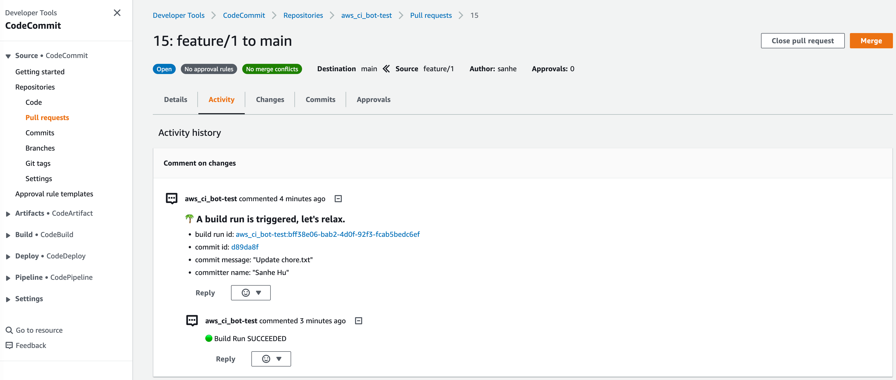

.. .. image:: https://readthedocs.org/projects/aws_ci_bot/badge/?version=latest
    :target: https://aws_ci_bot.readthedocs.io/index.html
    :alt: Documentation Status

.. .. image:: https://github.com/MacHu-GWU/aws_ci_bot-project/workflows/CI/badge.svg
    :target: https://github.com/MacHu-GWU/aws_ci_bot-project/actions?query=workflow:CI

.. .. image:: https://codecov.io/gh/MacHu-GWU/aws_ci_bot-project/branch/main/graph/badge.svg
    :target: https://codecov.io/gh/MacHu-GWU/aws_ci_bot-project

.. .. image:: https://img.shields.io/pypi/v/aws_ci_bot.svg
    :target: https://pypi.python.org/pypi/aws_ci_bot

.. .. image:: https://img.shields.io/pypi/l/aws_ci_bot.svg
    :target: https://pypi.python.org/pypi/aws_ci_bot

.. .. image:: https://img.shields.io/pypi/pyversions/aws_ci_bot.svg
    :target: https://pypi.python.org/pypi/aws_ci_bot

.. image:: https://img.shields.io/badge/STAR_Me_on_GitHub!--None.svg?style=social
    :target: https://github.com/MacHu-GWU/aws_ci_bot-project

------

.. .. image:: https://img.shields.io/badge/Link-Document-blue.svg
    :target: https://aws_ci_bot.readthedocs.io/index.html

.. .. image:: https://img.shields.io/badge/Link-API-blue.svg
    :target: https://aws_ci_bot.readthedocs.io/py-modindex.html

.. .. image:: https://img.shields.io/badge/Link-Source_Code-blue.svg
    :target: https://aws_ci_bot.readthedocs.io/py-modindex.html

.. .. image:: https://img.shields.io/badge/Link-Install-blue.svg
    :target: `install`_

.. image:: https://img.shields.io/badge/Link-GitHub-blue.svg
    :target: https://github.com/MacHu-GWU/aws_ci_bot-project

.. image:: https://img.shields.io/badge/Link-Submit_Issue-blue.svg
    :target: https://github.com/MacHu-GWU/aws_ci_bot-project/issues

.. image:: https://img.shields.io/badge/Link-Request_Feature-blue.svg
    :target: https://github.com/MacHu-GWU/aws_ci_bot-project/issues

.. .. image:: https://img.shields.io/badge/Link-Download-blue.svg
    :target: https://pypi.org/pypi/aws_ci_bot#files

Welcome to ``aws_ci_bot`` Documentation
==============================================================================
🤖 ``aws_ci_bot`` is a open source solution that allow you to create an CI/CD platform that is similar to "Jenkins", "GitHub Action", "CircleCI", "GitLab CI" in 30 minutes, in an empty "AWS Account" using AWS CodeCommit as the git repository, AWS CodeBuild as the CI build runtime, and the AWS Lambda Function as the CI-Bot.

It comes with a lot more advanced features that is highly customizable:

1. Automatically post comment, reply to your Pull Request activity about your CI job run status, code artifacts you just put, applications you just deployed.
2. Highly customizable trigger rules, allow you to use ``branch name``, ``commit message`` and everything to write your own rules to define "**when to trigger build and what exactly to build**", in pure python IF ELSE syntax.
3. Allow to use a Human-in-loop GUI to approve, deny build job run, from your browser or your cell phone, please see my ``aws_cicd_hil-project`` repo.

.. contents::
    :class: this-will-duplicate-information-and-it-is-still-useful-here
    :depth: 1
    :local:
