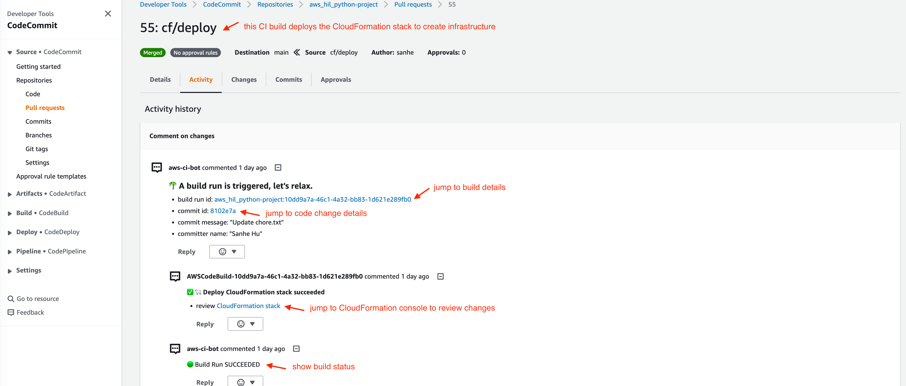
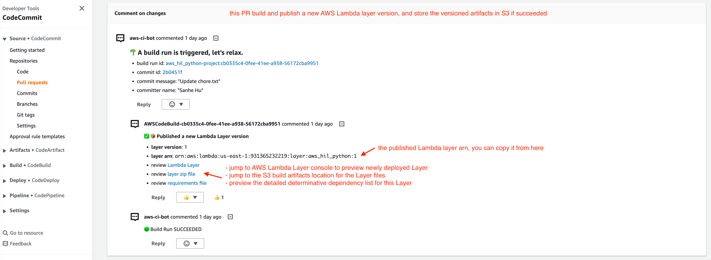
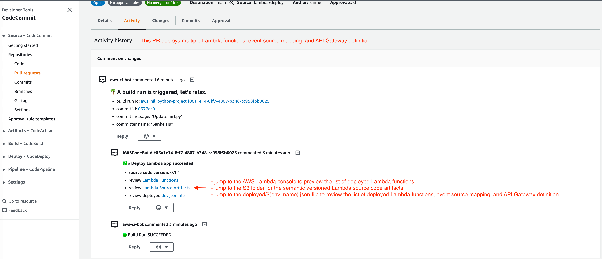
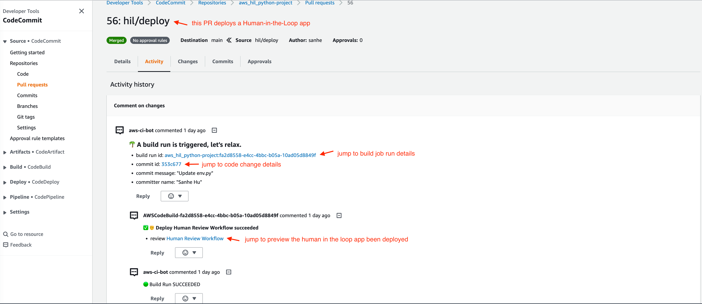
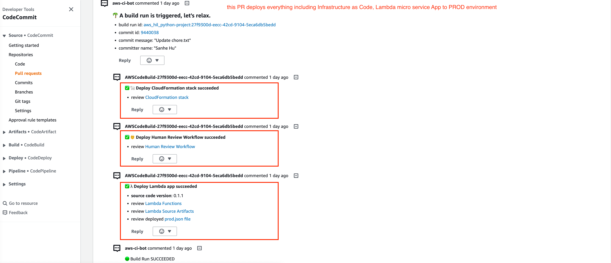

About This Solution
==============================================================================

Summary
------------------------------------------------------------------------------
AWS CI BOT is a fully serverless, scalable, customizable, flexible solution that allows you to set up a production ready CI build pipeline for as many git repositories on as many AWS Accounts.

- Serverless: this solution is fully serverless, meaning there is no need to set up any servers. It can be deployed in just a few minutes.
- Scalable: you can deploy our solution to multiple AWS regions and accounts, and it can support large number of Git repositories and CI build projects.
- Customizable: you can add your own Python script, giving you the flexibility to implement complex CI build strategies tailored to your specific needs.
- Flexible: you can apply different CI build strategies to different Git repositories or groups of repositories, providing you with the flexibility to optimize your CI pipeline.

How it Work
------------------------------------------------------------------------------
Below is the sample (default) workflow for CI build strategy in git pull request and code review. You can easily customize the workflow by adding your own if/else logics.

.. image:: ./images/pr-workflow.drawio.png

1. Developer created a branch and started a pull request to merge the ``feature`` branch to ``main``, the CodeCommit sent the PR event to SNS topic.
2. The SNS topic send the CodeCommit event to the Lambda Function CI-Bot.
3. The CI-Bot analyze the event, find out that it is a PR event and it should trigger a code build (This logic can be customized), so it post a comment to the PR about the build job link.
4. The CI-Bot triggers the CodeBuild job run.
5. Everytime the CI bot job run changed Phase, failed or succeeded, it send the CodeBuild event to the SNS topic.
6. The SNS topic send the CodeBuild event to the Lambda Function CI-Bot.
7. The CI-Bot post a reply to the PR comment to tell the developer the build job progress.

The screen shot below is what you see in a code review thread when you create a pull request from ``feature`` to ``main`` branch.

.. image:: ./images/comment-bot.png

By default, the bot automatically puts an comment to the pull request that includes the following information:

- an AWS CodeBuild job run link to the triggered CI build job. You can click the link to see the build job progress.
- an AWS CodeCommit git commit link to see what are changed in this pull request.
- the last commit author and the commit message

When the CI build job succeeded or failed, it will post a reply to the comment automatically.

Here are some more examples of ``aws_ci_bot`` automatically doing code review for a Microservice application project.

**Deploy infrastructure as code (IAC) via AWS CloudFormation**:

**Build versioned AWS Lambda Function dependency layer**:

**Deploy multiple AWS Lambda Functions, event source mapping configuration, and API Gateway definition**:

**Deploy a Human-in-the-loop review workflow**:

**Release the application to** ``prod`` **environment, and create immutable deploy artifacts in case we need rollback**:

Next Step
------------------------------------------------------------------------------
Now, let's learn how to deploy the ``aws_ci_bot`` solution to your AWS Account. It may take 30 minutes for the first time deployment. And then, it usually takes 5 minutes for adding new projects, or deploying to new AWS Regions or new AWS Accounts.

