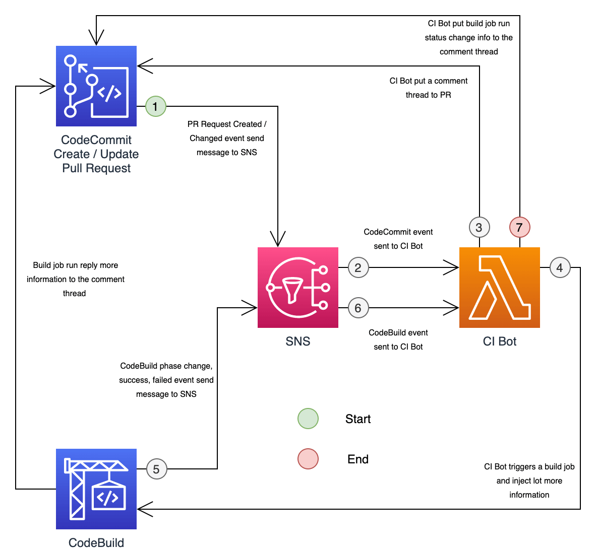
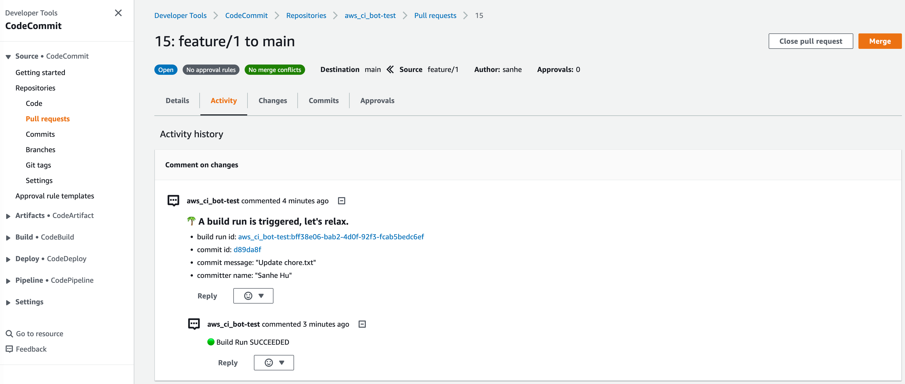

About This Solution
==============================================================================

Summary
------------------------------------------------------------------------------
AWS CI BOT is a fully serverless, scalable, customizable, flexible solution that allows you to set up a production ready CI/CD pipeline for many git repositories on many AWS Account.

- Serverless: this solution doesn't require any server to be set up. It is fully serverless and can be deployed in a few minutes.
- Scalable: this solution can be deployed to multiple AWS Regions and multiple AWS Accounts, and can support arbitrary many git repositories and CI build projects.
- Customizable: you can customize the CI behavior by adding your own Python script, it allows you to implement arbitrary complex CI build strategies to fullfill your needs.
- Flexible: you can apply different CI build strategies to different git repositories or group of git repositories.

How it Work
------------------------------------------------------------------------------
Below is the sample (default) workflow for CI build strategy in git pull request and code review. You can easily customize the workflow by adding your own if/else logics.

1. Developer created a branch and started a pull request to merge the ``feature`` branch to ``main``, the CodeCommit sent the PR event to SNS topic.
2. The SNS topic send the CodeCommit event to the Lambda Function CI-Bot.
3. The CI-Bot analyze the event, find out that it is a PR event and it should trigger a code build (This logic can be customized), so it post a comment to the PR about the build job link.
4. The CI-Bot triggers the CodeBuild job run.
5. Everytime the CI bot job run changed Phase, failed or succeeded, it send the CodeBuild event to the SNS topic.
6. The SNS topic send the CodeBuild event to the Lambda Function CI-Bot.
7. The CI-Bot post a reply to the PR comment to tell the developer the build job progress.

The screen shot below is what you see in a code review thread when you create a pull request from ``feature`` to ``main`` branch.

By default, the bot automatically puts an comment to the pull request that includes the following information:

- an AWS CodeBuild job run link to the triggered CI build job. You can click the link to see the build job progress.
- an AWS CodeCommit git commit link to see what are changed in this pull request.
- the last commit author and the commit message

When the CI build job succeeded or failed, it will post a reply to the comment automatically.
