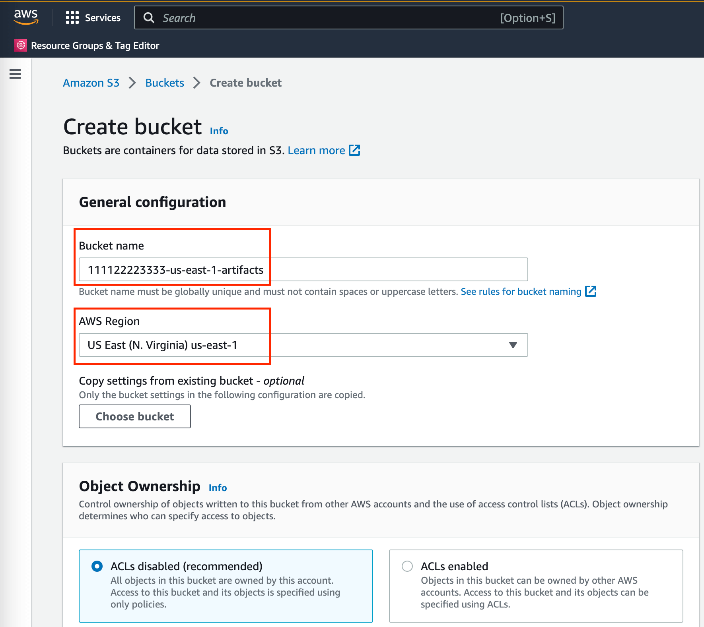
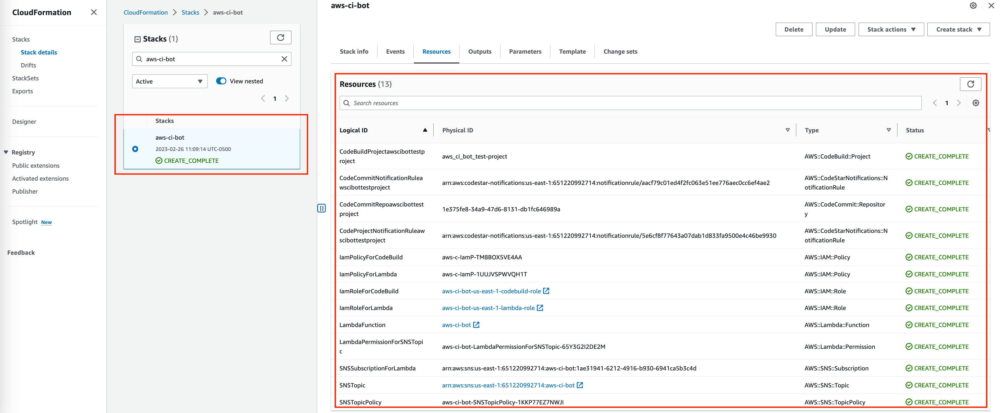

How to Deploy
==============================================================================
In this tutorial, we will use an empty, newly created AWS Account as an example to deploy this solution.

.. contents::
    :class: this-will-duplicate-information-and-it-is-still-useful-here
    :depth: 1
    :local:

Pre-requisites
------------------------------------------------------------------------------
1. You have to have a laptop or `AWS EC2 <https://aws.amazon.com/ec2/>`_ or `AWS Cloud9 <https://aws.amazon.com/cloud9/>`_ machine to some deployment commands. In this tutorial, we assume that you use your laptop.
2. You should have Python3.8 installed on your laptop. This solution is developed and tested on Python3.8, it should works for Python3.7+ as well. Use the same Python version to deploy the solution can avoid unexpected error.
3. You have configured AWS CLI Credentials on your laptop. You can either use `IAM User <https://docs.aws.amazon.com/IAM/latest/UserGuide/id_users_create.html>`_ or `Single-Sign-On <https://docs.aws.amazon.com/singlesignon/latest/userguide/what-is.html>`_ to get your credentials, make sure you have the following permissions. The easiest way to get these permissions is to attach the following AWS Managed Policies to your IAM user. Of course, you can also create your own custom IAM policy, but it takes more time to develop one.
    - ``arn:aws:iam::aws:policy/IAMFullAccess``: we need this permission to create IAM role and policy.
    - ``arn:aws:iam::aws:policy/AmazonS3FullAccess``: we need this permission to manipulate AWS Lambda deployment package and CloudFormation template in S3 bucket.
    - ``arn:aws:iam::aws:policy/AWSCodeCommitFullAccess``: we need this permission to create and configure CodeCommit repository.
    - ``arn:aws:iam::aws:policy/AWSCodeBuildAdminAccess``: we need this permission to create and configure CodeBuild project.
    - ``arn:aws:iam::aws:policy/AWSCodeStarFullAccess``: we need this permission to create CodeCommit and CodeBuild Notification rules.
    - ``arn:aws:iam::aws:policy/AWSLambda_FullAccess``: we need this permission to create AWS Lambda function.
    - ``arn:aws:iam::aws:policy/AmazonSNSFullAccess``: we need this permission to create
    - ``arn:aws:iam::aws:policy/AWSCloudFormationFullAccess``: we need this permission to deploy the solution via AWS CloudFormation.
    - ``sts:GetCallerIdentity``: we need this permission to figure out the AWS Account ID.
4. `Create an S3 bucket <https://s3.console.aws.amazon.com/s3/bucket/create>`_ to store the CloudFormation template and the CI bot events. Just enter the "Bucket name" and "AWS Region" and leave everything else as the default. By default, it block public access and the data is encrypted at the rest. I personally prefer to use ``${aws_account_id}-${aws_region}-artifacts``, for example ``111122223333-us-east-1-artifacts`` for the bucket name.

Deploy the Solution
------------------------------------------------------------------------------
1. Run the following command to clone the specific version of this solution to your laptop. You can find the release history in the `release-history.rst <https://github.com/MacHu-GWU/aws_ci_bot-project/blob/main/release-history.rst>`_ file. The ``${version}`` has to match the release version.

.. code-block:: bash

    # Command
    git clone --depth 1 --branch ${version} https://github.com/MacHu-GWU/aws_ci_bot-project.git

    # Example
    git clone --depth 1 --branch 0.3.1 https://github.com/MacHu-GWU/aws_ci_bot-project.git

2. Create an Python virtual environment and install the required Python dependencies:

.. code-block:: bash

    # CD to the project root directory
    cd /path/to/aws_ci_bot-project

    # Create a Python virtual environment
    # the virtualenv is created at /path/to/aws_ci_bot-project/.venv/
    virtualenv -p python3.8 .venv

    # Enter the virtual environment
    source ./.venv/bin/activate

    # Install necessary dependencies for deployment
    pip install -e .
    pip install -r requirements-dev.txt

3. (optional) Edit the python function ``def check_what_to_do()`` in the `codecommit_rule.py <./aws_ci_bot/codecommit_rule.py>`_ file. This function determines when to trigger an AWS CodeBuild build job based on your custom Git branching and commit rules, as well as which branch, tag, or commit to build from. The default settings are suitable for most use cases, but you can customize the function by following the comments provided.

4. Edit the `deploy-config.json <./deploy/deploy-config.json>`_, follow the `instruction in the comment <https://github.com/MacHu-GWU/aws_ci_bot-project/blob/main/deploy/deploy-config.json>`_ to update the deployment config according to your needs.

3. Run `deploy_aws_ci_bot.py <./deploy/deploy_aws_ci_bot.py>`_ script to deploy this solution to one region in your AWS Account.

.. code-block:: bash

    python ./deploy/deploy_aws_ci_bot.py

A Concrete Example
------------------------------------------------------------------------------
.. contents::
    :class: this-will-duplicate-information-and-it-is-still-useful-here
    :depth: 1
    :local:

CI Strategy Definition
~~~~~~~~~~~~~~~~~~~~~~~~~~~~~~~~~~~~~~~~~~~~~~~~~~~~~~~~~~~~~~~~~~~~~~~~~~~~~~
Below is the default CI strategy definition in the `codecommit_rule.py <./aws_ci_bot/codecommit_rule.py>`_ file. The default CI strategy is:

- We don't build if commit message has 'chore'.
- We don't build for direct commit.
- We only build for 'Pull Request create / update' event, only if the source branch is the following pre-defined branch, regardless of the target branch.
- We build for all 'Pull Request merge' event.
- We don't build for any other events, such as 'create branch', 'delete branch', 'comment', 'approve pr'.

.. code-block:: python

    def check_what_to_do(cc_event: CodeCommitEvent) -> CodeCommitHandlerActionEnum:
        logger.header("Detect whether we should trigger build", "-", 60)
        # ----------------------------------------------------------------------
        # We don't build if commit message has 'chore'
        # ----------------------------------------------------------------------
        if is_certain_semantic_commit(
            cc_event.commit_message,
            stub=SemanticCommitEnum.chore.value,
        ):
            logger.info(
                f"we DO NOT trigger build job for "
                f"commit message {SemanticCommitEnum.chore.value!r}"
            )
            return CodeCommitHandlerActionEnum.nothing
        # ==========================================================================
        # Case 1: direct commit to any branch
        #
        # either you write your own if/else logic here,
        # either you uncomment one and only one of the following block of code:
        # 1.1 (default), 1.2, 1.3
        # ==========================================================================
        if cc_event.is_commit_event:
            # ----------------------------------------------------------------------
            # 1.1 Don't build for direct commit
            # ----------------------------------------------------------------------
            logger.info(
                f"we don't trigger build job for "
                f"event type {cc_event.event_type!r} on {cc_event.source_branch}"
            )
            return CodeCommitHandlerActionEnum.nothing
        # ==========================================================================
        # Case 2: Pull Request create / update event
        #
        # either you write your own if/else logic here,
        # either you uncomment one and only one of the following block of code:
        # 2.1, 2.2, 2.3 (default)
        # ==========================================================================
        elif cc_event.is_pr_created_event or cc_event.is_pr_update_event:
            # ----------------------------------------------------------------------
            # 2.3 Build for Pull Request create / update event only if the source
            # branch is the following pre-defined branch, regardless of the target branch
            # ----------------------------------------------------------------------
            if (
                # based on purpose
                cc_event.source_is_feature_branch
                or cc_event.source_is_fix_branch
                or cc_event.source_is_build_branch
                or cc_event.source_is_doc_branch
                or cc_event.source_is_release_branch
                or is_certain_semantic_branch(cc_event.source_branch, ["clean", "cleanup"])
                # based on environment
                or cc_event.source_is_develop_branch
                or is_certain_semantic_branch(cc_event.source_branch, ["test"])
                or is_certain_semantic_branch(cc_event.source_branch, ["int"])
                or is_certain_semantic_branch(cc_event.source_branch, ["stage", "staging"])
                or is_certain_semantic_branch(cc_event.source_branch, ["qa"])
                or is_certain_semantic_branch(cc_event.source_branch, ["preprod"])
                or is_certain_semantic_branch(cc_event.source_branch, ["prod"])
                or is_certain_semantic_branch(cc_event.source_branch, ["blue"])
                or is_certain_semantic_branch(cc_event.source_branch, ["green"])
            ):
                logger.info(
                    f"trigger build for pull request from {cc_event.source_branch!r} branch."
                )
                return CodeCommitHandlerActionEnum.start_build
            else:
                logger.info(
                    "we DO NOT trigger build job "
                    f"if PR source branch is {cc_event.target_branch!r}"
                )
                return CodeCommitHandlerActionEnum.nothing
        # ==========================================================================
        # Case 3: Pull Request merge event
        #
        # either you write your own if/else logic here,
        # either you uncomment one and only one of the following block of code:
        # 3.1 (default), 3.2
        # ==========================================================================
        elif cc_event.is_pr_merged_event:
            # ----------------------------------------------------------------------
            # 3.1 Build for all Pull Request merge event
            # ----------------------------------------------------------------------

            logger.info(
                f"trigger build job for PR merged event, from branch "
                f"{cc_event.source_branch!r} to {cc_event.target_branch!r}"
            )
            return CodeCommitHandlerActionEnum.start_build
        # ==========================================================================
        # Case 4: Other event
        #
        # either you write your own if/else logic here, either use the default
        # ==========================================================================
        # we don't trigger on other event
        elif (
            cc_event.is_create_branch_event
            or cc_event.is_delete_branch_event
            or cc_event.is_comment_event
            or cc_event.is_approve_pr_event
        ):
            logger.info(
                f"we don't trigger build job for " f"event type {cc_event.event_type!r}."
            )
            return CodeCommitHandlerActionEnum.nothing
        else:
            logger.info(
                f"we don't trigger build job for " f"event type {cc_event.event_type!r}."
            )
            return CodeCommitHandlerActionEnum.nothing

Deploy Config Definition
~~~~~~~~~~~~~~~~~~~~~~~~~~~~~~~~~~~~~~~~~~~~~~~~~~~~~~~~~~~~~~~~~~~~~~~~~~~~~~
Below is a sample ``deploy-config.json`` file. It defines that:

- ``aws_ci_bot`` is the common name prefix for all AWS resources used in this solution.
- on my local laptop, I use the ``my_aws_profile`` AWS CLI profile to deploy this solution.
- I want to deploy this solution to the ``us-east-1`` region.
- I use the ``111122223333-us-east-1-artifacts`` S3 bucket to store my deployment artifacts, it is already created in the "Pre-requisites" section.
- Deployment artifacts is stored in the ``projects/aws-ci-bot/`` S3 folder.
- I want to create only one CodeCommit repo ``aws_ci_bot_test-project`` and configure it for CI.
- I want to create only one CodeBuild project ``aws_ci_bot_test-project`` and configure it for CI.

.. code-block:: javascript

    // it is the deployment config file when you use infrastructure as code to deploy
    // the ``aws_ci_bot`` solution.
    //
    // NOTE: this JSON file allow comments, you DON'T have to remove comment before deployment
    {
        // the common name prefix for AWS resources
        // you may deploy multiple instances of this solution
        // to the same AWS account in the same region because you want to apply
        // different CI strategy to differeng git repos
        // you can just change the 'project_name' to differentiate them
        "project_name": "aws_ci_bot",
        // the aws profile you want to use to run deployment script
        // it is the profile name in ~/.aws/credentials
        // in the most of the case, I use the ``AdministratorAccess`` policy
        // if you want to use a custom policy, please refer to the
        // "Pre-requisites" section in the "How to Deploy" document to identify
        // the required permissions
        "aws_profile": "my_aws_profile",
        "aws_region": "us-east-1",
        // where you want to store Lambda deploymeng package,
        // CloudFormation template upload, and CI/CD event data.
        "s3_bucket": "111122223333-us-east-1-artifacts",
        "s3_prefix": "projects/aws-ci-bot/",
        // the list of CodeCommit repo you want to create
        "codecommit_repo_list": [
            "aws_ci_bot_test-project"
        ],
        // the list of CodeBuild project you want to create
        // one CodeCommit repo may trigger multiple CodeBuild projects
        "codebuild_project_list": [
            // following the following CloudFormation document to customize your CodeBuild project
            // https://docs.aws.amazon.com/AWSCloudFormation/latest/UserGuide/aws-resource-codebuild-project.html
            {
                // the name of the CodeBuild project
                "project_name": "aws_ci_bot_test-project",
                // the CodeCommit repo name that you want to build from
                "repo_name": "aws_ci_bot_test-project",
                // the environment type to run the build job
                // you can see full list of available compute types in this document
                // https://docs.aws.amazon.com/AWSCloudFormation/latest/UserGuide/aws-properties-codebuild-project-environment.html#cfn-codebuild-project-environment-type
                "environment_type": "LINUX_CONTAINER",
                // the docker image to run the build job
                // by default, we use the CodeBuild provided docker image
                // based on my experience, the amazonlinux2-x86_64-standard:3.0 is the most stable one as of 2023-01-01
                // https://docs.aws.amazon.com/codebuild/latest/userguide/build-env-ref-available.html
                // you can find more information about this config in this document
                // https://docs.aws.amazon.com/AWSCloudFormation/latest/UserGuide/aws-properties-codebuild-project-environment.html#cfn-codebuild-project-environment-image
                "image_id": "aws/codebuild/amazonlinux2-x86_64-standard:3.0",
                // the instance type to run the build job
                // you can see full list of available compute types in this document
                // https://docs.aws.amazon.com/AWSCloudFormation/latest/UserGuide/aws-properties-codebuild-project-environment.html#cfn-codebuild-project-environment-computetype
                "compute_type": "BUILD_GENERAL1_SMALL",
                "privileged_mode": true, // if you need to build docker in docker, then set true, otherwise use false
                "timeout_in_minutes": 15, // how long the build job will time out
                "queued_timeout_in_minutes": 30, // how long the build job will be queued before it is timed out
                "concurrent_build_limit": 5 // maximum number of concurrent builds
            }
        ]
    }

Run Deployment Script
~~~~~~~~~~~~~~~~~~~~~~~~~~~~~~~~~~~~~~~~~~~~~~~~~~~~~~~~~~~~~~~~~~~~~~~~~~~~~~
Below is the sample command line prompt when I run ``python ./deploy/deploy_aws_ci_bot.py``, it build the Lambda deployment package, and deploy the solution via CloudFormation template. As you can see in the CloudFormation deployment log, we created the following AWS resources:

- one IAM Role and Policy for Lambda Function.
- one IAM Role and Policy for Codebuild job run.
- one SNS Topic to receive CodeCommit and CodeBuild notification event.
- several of CodeCommit and CodeBuild notification rules are created.
- one Lambda function to handle notification event and trigger build job based on the CI strategy we defined.

::

    Collecting superjson==1.0.2
      Using cached superjson-1.0.2-py2.py3-none-any.whl (30 kB)
    Installing collected packages: superjson
    Successfully installed superjson-1.0.2
    Collecting boto_session_manager==1.3.2
      Using cached boto_session_manager-1.3.2-py2.py3-none-any.whl (43 kB)
    Installing collected packages: boto_session_manager
    Successfully installed boto_session_manager-1.3.2
    Collecting aws_lambda_event==2.0.2
      Using cached aws_lambda_event-2.0.2-py2.py3-none-any.whl (36 kB)
    Installing collected packages: aws_lambda_event
    Successfully installed aws_lambda_event-2.0.2
    Collecting aws_codecommit==1.4.1
      Using cached aws_codecommit-1.4.1-py2.py3-none-any.whl (21 kB)
    Installing collected packages: aws_codecommit
    Successfully installed aws_codecommit-1.4.1
    Collecting aws_codebuild==1.2.1
      Using cached aws_codebuild-1.2.1-py2.py3-none-any.whl (13 kB)
    Installing collected packages: aws_codebuild
    Successfully installed aws_codebuild-1.2.1
    Processing /Users/sanhehu/Documents/GitHub/aws_ci_bot-project
      Preparing metadata (setup.py): started
      Preparing metadata (setup.py): finished with status 'done'
    Building wheels for collected packages: aws-ci-bot
      Building wheel for aws-ci-bot (setup.py): started
      Building wheel for aws-ci-bot (setup.py): finished with status 'done'
      Created wheel for aws-ci-bot: filename=aws_ci_bot-0.3.1-py3-none-any.whl size=28543 sha256=9845dd38c2f3ef4a4be328978d00a292217b5c1ed40dd0d94533c00251d47fa1
      Stored in directory: /Users/sanhehu/Library/Caches/pip/wheels/f5/8d/fc/18bfae466c09eec3c988a8d2f04aadedc4974d24734dfefbd4
    Successfully built aws-ci-bot
    Installing collected packages: aws-ci-bot
    Successfully installed aws-ci-bot-0.3.1
    open cloudformation console for status: https://console.aws.amazon.com/cloudformation/home?region=us-east-1#/stacks?filteringStatus=active&filteringText=aws-ci-bot&viewNested=true&hideStacks=false&stackId=
    ================== Deploy stack: aws-ci-bot ==================
      preview stack in AWS CloudFormation console: https://console.aws.amazon.com/cloudformation/home?#/stacks?filteringStatus=active&filteringText=aws-ci-bot&viewNested=true&hideStacks=false
      preview change set details at: https://us-east-1.console.aws.amazon.com/cloudformation/home?region=us-east-1#/stacks/changesets/changes?stackId=arn:aws:cloudformation:us-east-1:111122223333:stack/aws-ci-bot/e98ee260-b5ef-11ed-a6a1-0e24035d53dd&changeSetId=arn:aws:cloudformation:us-east-1:111122223333:changeSet/aws-ci-bot-2023-02-26-16-09-13-755/b8e109e1-fb4c-4d32-81cc-8d9e66077841
      wait for change set creation to finish ...
        on 2 th attempt, elapsed 10 seconds, remain 170 seconds ...
        reached status CREATE_COMPLETE
                        >>> Change for stack aws-ci-bot <<<
    stack id = arn:aws:cloudformation:us-east-1:111122223333:stack/aws-ci-bot/e98ee260-b5ef-11ed-a6a1-0e24035d53dd
    change set id = arn:aws:cloudformation:us-east-1:111122223333:changeSet/aws-ci-bot-2023-02-26-16-09-13-755/b8e109e1-fb4c-4d32-81cc-8d9e66077841
    +---------------------------- Change Set Statistics -----------------------------
    | 🟢 Add        13 Resources
    |
    +--------------------------------------------------------------------------------
    +----------------------------------- Changes ------------------------------------
    | 🟢 📦 Add Resource:        CodeBuildProjectawscibottestproject               AWS::CodeBuild::Project
    | 🟢 📦 Add Resource:        CodeCommitNotificationRuleawscibottestproject     AWS::CodeStarNotifications::NotificationRule
    | 🟢 📦 Add Resource:        CodeCommitRepoawscibottestproject                 AWS::CodeCommit::Repository
    | 🟢 📦 Add Resource:        CodeProjectNotificationRuleawscibottestproject    AWS::CodeStarNotifications::NotificationRule
    | 🟢 📦 Add Resource:        IamPolicyForCodeBuild                             AWS::IAM::Policy
    | 🟢 📦 Add Resource:        IamPolicyForLambda                                AWS::IAM::Policy
    | 🟢 📦 Add Resource:        IamRoleForCodeBuild                               AWS::IAM::Role
    | 🟢 📦 Add Resource:        IamRoleForLambda                                  AWS::IAM::Role
    | 🟢 📦 Add Resource:        LambdaFunction                                    AWS::Lambda::Function
    | 🟢 📦 Add Resource:        LambdaPermissionForSNSTopic                       AWS::Lambda::Permission
    | 🟢 📦 Add Resource:        SNSSubscriptionForLambda                          AWS::SNS::Subscription
    | 🟢 📦 Add Resource:        SNSTopicPolicy                                    AWS::SNS::TopicPolicy
    | 🟢 📦 Add Resource:        SNSTopic                                          AWS::SNS::Topic
    |
    +--------------------------------------------------------------------------------
        need to execute the change set to apply those changes.
      preview create stack progress at: https://us-east-1.console.aws.amazon.com/cloudformation/home?region=us-east-1#/stacks/stackinfo?filteringText=aws-ci-bot&viewNested=true&hideStacks=false&stackId=arn:aws:cloudformation:us-east-1:111122223333:stack/aws-ci-bot/e98ee260-b5ef-11ed-a6a1-0e24035d53dd&filteringStatus=active
     wait for deploy to finish ...
        on 11 th attempt, elapsed 55 seconds, remain 125 seconds ...
        reached status 🟢 'CREATE_COMPLETE'
      done

Next Step
------------------------------------------------------------------------------
We successfully deployed the ``aws_ci_bot`` solution to your AWS Account. Now let's use a dummy CodeCommit repository to test this solution.
