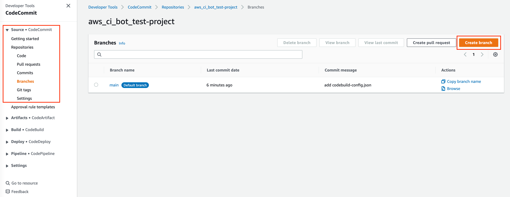
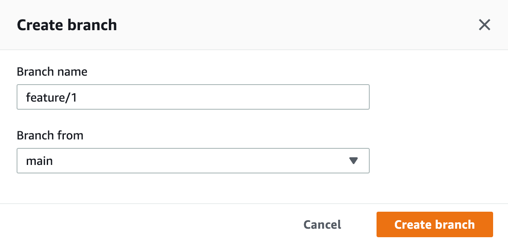
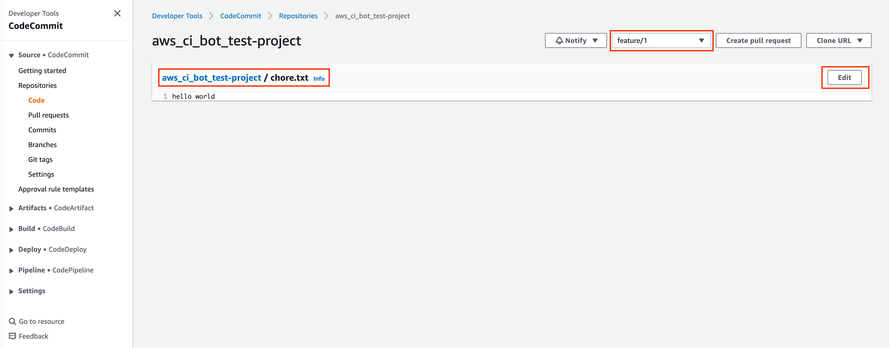
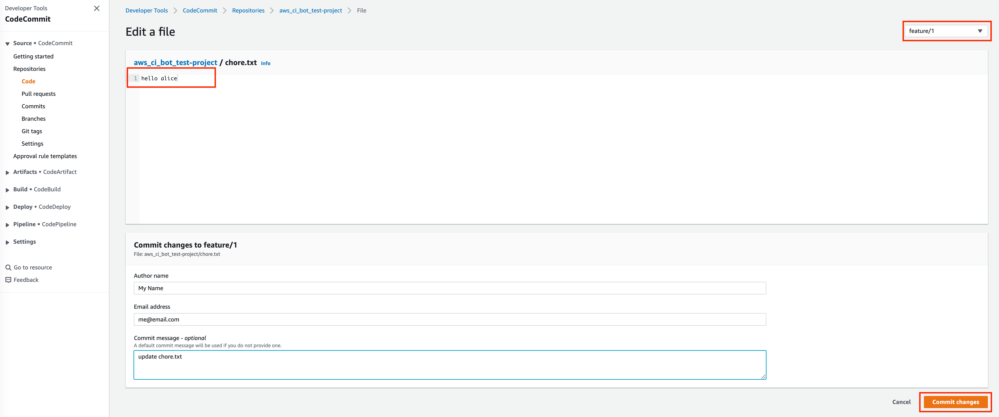
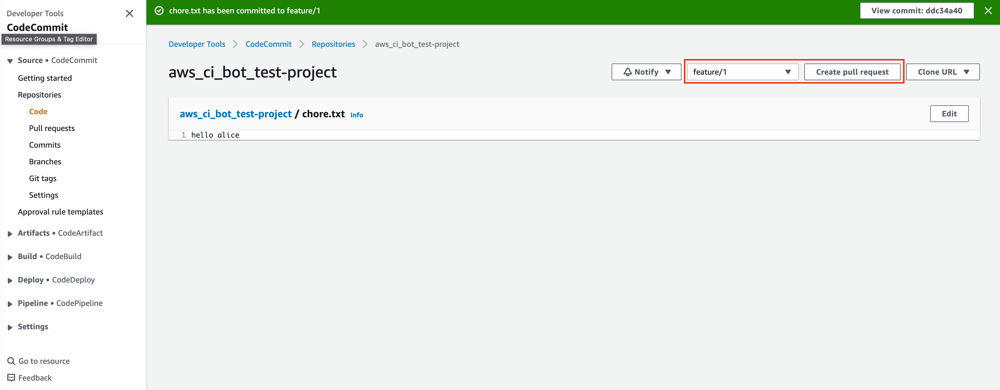
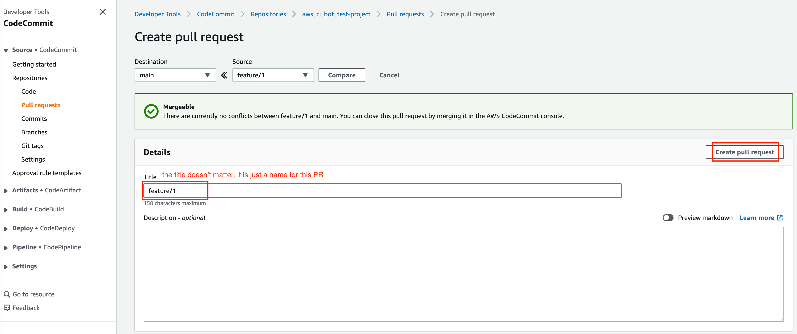
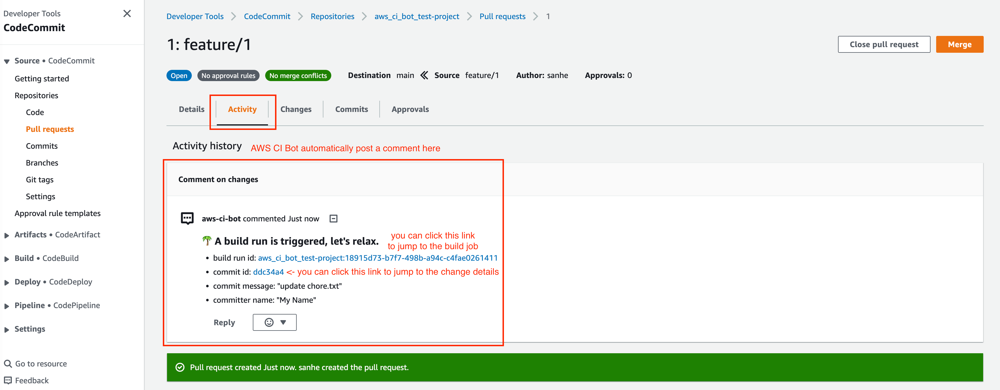

Test This Solution
==============================================================================
In the previous steps, we successfully deployed the ``aws_ci_bot`` solution to your AWS account. Now, we can use a dummy CodeCommit repository to test this solution. As part of the deployment, a CodeCommit repository called ``aws_ci_bot_test-project`` and a CodeBuild project with the same name were created. We will use these resources to test the solution.

Add necessary files to your CodeCommit repository
------------------------------------------------------------------------------
Currently, the ``aws_ci_bot_test-project`` repository is empty, so we need to add some files to it. Fortunately, you can do this via the AWS CodeCommit console without having to install any Git clients. In this document, we will be using the AWS CodeCommit console to add the necessary files. However, feel free to use your favorite Git client if you prefer.

- Find your repo in `AWS CodeCommit Repositories Console <https://console.aws.amazon.com/codesuite/codecommit/repositories?#>`_.
- Add the ``codebuild-config.json`` file, so the CI-Bot knows that which CodeBuild project you want to use to run CI for this repo:
    - You can click "Create File".

    .. image:: ./images/create-file.png

    - Post the following JSON body and add the file, set "File name" as ``codebuild-config.json``, put your "Author name" and "Email address", then click "Commit Changes":

    .. code-block:: javascript

        {
            "jobs": [
                {
                    "project_name": "aws_ci_bot_test-project",
                    "is_batch_job": false,
                    "buildspec": "",
                    "env_var": {}
                }
            ]
        }

    .. image:: ./images/add-codebuild-config.png

- Add the ``buildspec.yml`` file, so the CodeBuild knows what to run in build job. In this example, it is just a dummy build job that runs a lot of ``echo`` commands.
    - You can click "Add File", "Create File".

    .. image:: ./images/add-file.png

    - Put the following content and add the file, set "File name" as ``buildspec.yml``, put your "Author name" and "Email address", then click "Commit Changes":

    .. code-block:: yml

        # Ref: https://docs.aws.amazon.com/codebuild/latest/userguide/build-spec-ref.html
        version: 0.2

        phases:
          install:
            runtime-versions:
              python: 3.8
            commands:
              - echo "install phase"
          pre_build:
            commands:
              - echo "pre_build phase"
          build:
            commands:
              - echo "build phase"
          post_build:
            commands:
              - echo "post_build phase"

    .. image:: ./images/add-buildspec-yml.png

- Add a ``chore.txt`` file. Because this is an example repo, we can simulate that we are adding new features by updating the content of the ``chore.txt`` file. You can click "Add File", "Create File", put ``hello world`` to the content, set "File name" as ``chore.txt``, put your "Author name" and "Email address", then click "Commit Changes"

Now this repo is all set for testing. In production, this is also the step we should do before checking in any real application code.

Trigger a Build Job by Creating a Pull Request
~~~~~~~~~~~~~~~~~~~~~~~~~~~~~~~~~~~~~~~~~~~~~~~~~~~~~~~~~~~~~~~~~~~~~~~~~~~~~~
In the :ref:`ci-strategy-definition` section, our CI strategy is:

- We only build for 'Pull Request create / update' event, only if the source branch is the following pre-defined branch (please check the :ref:`ci-strategy-definition` for details), regardless of the target branch.

Now we want to simulate a scenario that a developer created a new branch, and started a Pull Request to merge to the ``main`` branch.

1. Find your repo in `AWS CodeCommit Repositories Console <https://console.aws.amazon.com/codesuite/codecommit/repositories?#>`_, enter your repo, then click "Branches" on the side bar.
2. Click "Create branch" button and give it a name called ``feature/1``.

3. Switch to ``feature/1`` branch, and edit the ``chore.txt`` file, enter random value to the content like ``hello alice``, and commit the change.

4. Click "Create pull request" button, choose to merge from ``feature/1`` to ``main``, give it a random title and click the "Create pull request" button.

5. **Switch to** "Activity" Tab, **you will see the CI bot just triggered a CodeBuild job run and automatically posted a comment to the PR**, you can click on the link to jump to the CodeBuild job run, or to the detailed changes for the commit. **After a while, when the job run Success or Failed, the CI bot will automatically reply to the comment and tell your the result**.

**Sample Comment**

    🌴 A build run is triggered, let's relax.

    - build run id: `aws_ci_bot-test:cd78cc7e-f538-405e-b4a0-5dddf96fe0f7 <https://us-east-2.console.aws.amazon.com/codesuite/codebuild/111122223333/projects/aws_ci_bot-test/build/aws_ci_bot-test:cd78cc7e-f538-405e-b4a0-5dddf96fe0f7/?region=us-east-2>`_
    - commit id: `c9f2463 <https://us-east-2.console.aws.amazon.com/codesuite/codecommit/repositories/aws_ci_bot-test/pull-requests/1/commit/c9f246376b88d6d63dc02e61059f31d3fc3227c4?region=us-east-2>`_
    - commit message: "Edited chore.txt"
    - committer name: "alice"

    🟢 Build Run SUCCEEDED